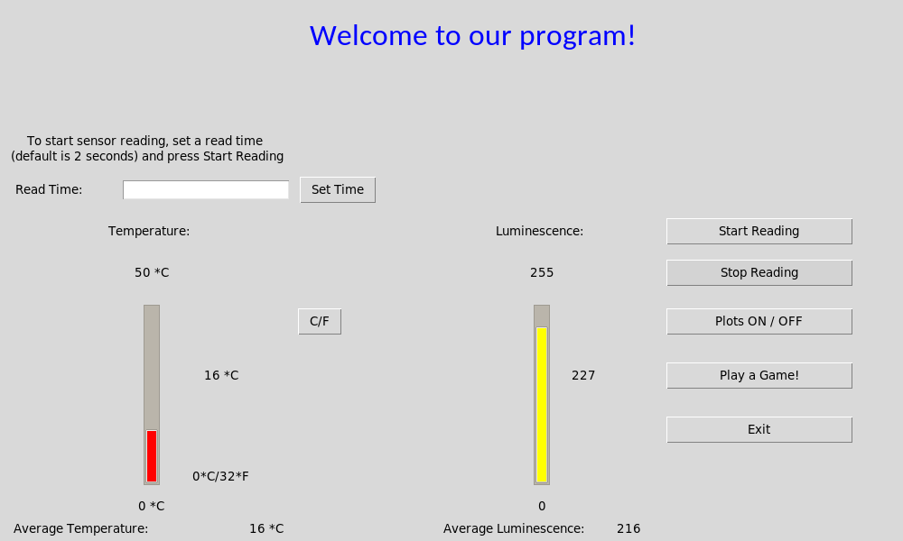
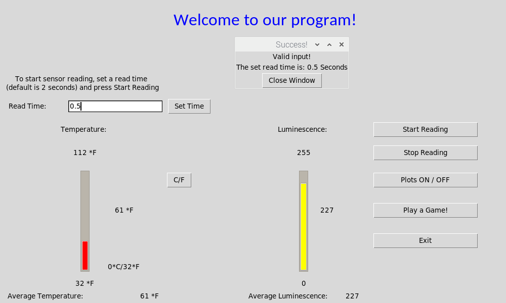
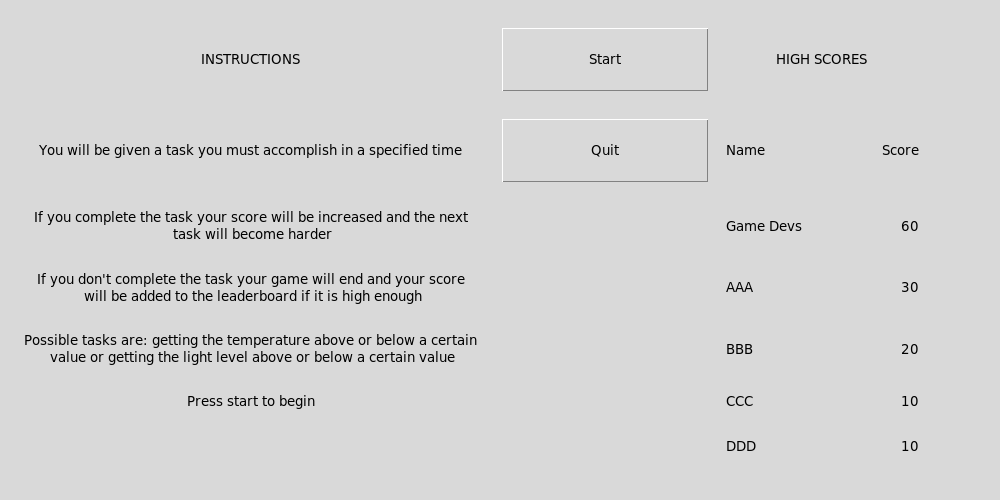

# Raspberry-Pi-temp-lum-game
Welcome to my Raspberry Pi Temperature and Luminescence Game that was developed by my team for UBC's Computer Engineering Design course.

Overview:
- The purpose of the project was to incorporate temperature and luminescence data off raspberry pi sensors and display analytical data
such as averages or most recent data in a unique Tkinter GUI
- Additional features were added to make the GUI standout and have dynamic bars for temperature and light readings
- A mini-game was designed to incorporate this data and highscores were recorded for a little fun!

Features:
- Raspberry Pi 4 GPIO with LM35 Temperature sensor and a photocell
- Adafruit libraries
- Tkinter GUI with matplotlib
- Multistage functioning game

Usage and Details:
- The program runs and temperature and luminescence data is updated by a daemon thread
- Values are presented in the GUI, updating as the values are read
- A game window can be opened with a leaderboard and various levels to conquer

Images:
Program Running with sensor data being shown

Changing the read time of the sensors

Game Window

RoadMap:
- The project was initially just a temperature and luminescence visualizer, but was converted into a game based off our team's love
to make something fun
- Initial bugs occured when the daemon threads interfered with the Game window, or with the graphical displays. This was fixed by
closing the approriate windows and reopening them such that multiple windows were not taking up performance

Credits:
- Thanks to wkk0407 and GradyThompson for being amazing teammates and for working day and night on making the game such a fun success
